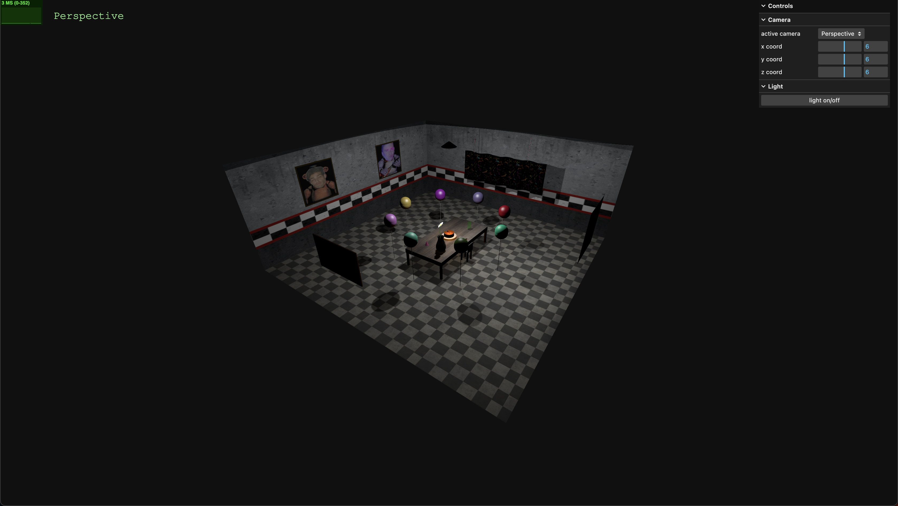
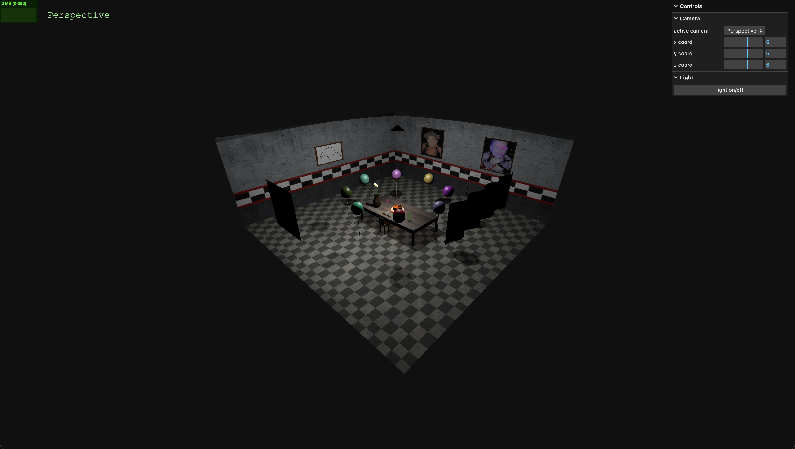
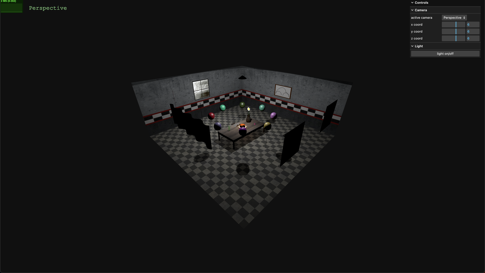
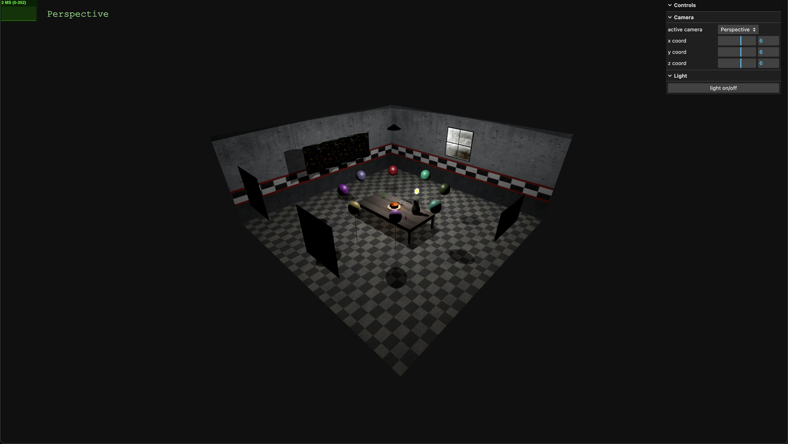

# SGI 2023/2024 - TP1

## Group T04G10
| Name             | Number    | E-Mail             |
| ---------------- | --------- | ------------------ |
| Tiago Barbosa    | 202004926 | <up202004926@edu.fe.up.pt>|
| Guilherme Almeida    | 202008866 | <up202008866@edu.fe.up.pt>|

----
## Project information

- Strong Points
  - idea/concept of the room
  - requested objects like newspaper, spring, flower etc. are detailed and realistc
  - code is well organized
  - creativity on aditional objects  
- Scene
  - This scene is inspired on the 5 Night's at Freddys game room. From the floor and walls texture, to the paintings on the wall with the main characters of the game, this scene tries to replicate the spookiness of the video game, while envolving the requested objects for this delivery.

  - (relative link to the scene)
----
## Issues/Problems

- We tried to implement a "broken" lightbulb, with a twitching light, but it didn't come out as we wanted. Therefore we decided it was best to leave this feature for a future delivery.
- We implemented two flashlights that sit on top of the table and help illuminate the cake. When the flashlights were added the FPS of the scene deacreased a significant amout, so it was decided to comment that section of the code.

---
## Screenshots

