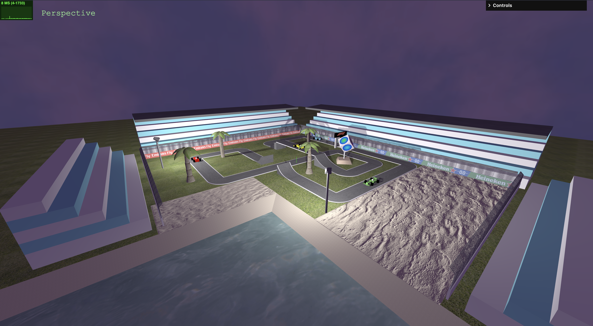

# SGI 2023/2024 - TP2

## Group T04G10
| Name             | Number    | E-Mail             |
| ---------------- | --------- | ------------------ |
| Tiago Barbosa    | 202004926 | <up202004926@edu.fe.up.pt>|
| Guilherme Almeida    | 202008866 | <up202008866@edu.fe.up.pt>|

----
## Project information

- Strong Points
  - idea/concept of the scene
  - variety of textures and types of textures
  - variety of objects
  - diverse GUI
- Scene
  - This scene is inspired on a F1 track. It has a track with some cars running through it. It also has a tropical vibe with palm trees and a beach. We also added a litle cube statue with art on it and some stands for the audience.

- tp2/index.html

----

## Issues/Problems

- Textures for triangle is still not working
- The clone of nodes is not perfect so we remove it from the builder

---

## Screenshots

