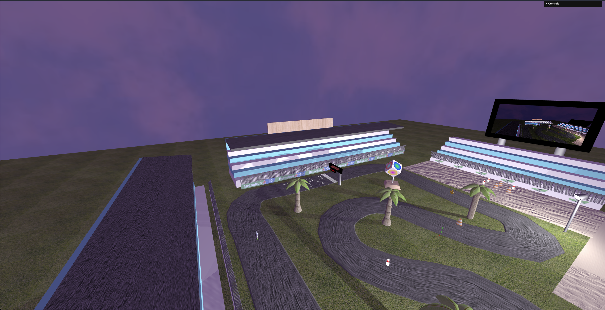

# SGI 2023/2024 - TP3

## Group T04G10

| Name             | Number    | E-Mail                          |
| ---------------- | --------- | -------------------------------- |
| Tiago Barbosa    | 202004926 | <up202004926@edu.fe.up.pt>      |
| Guilherme Almeida| 202008866 | <up202008866@edu.fe.up.pt>      |

----

## Project information

### Strong Points

Our project highlights several strong points:

- Implementation of realistic physics for car movements.
- Intuitive user interface design.
- Effective collision detection and handling.
- Outdoor display of the game scene.

### Scene

The scene depicts a formula 1 like racing track with a few obstacles and a finish line. The player is tasked with completing a lap around the track as fast as possible, while avoiding the obstacles and staying on the track.

### tp3/index.html

The `tp3/index.html` file serves as the main entry point for our project, hosting the game interface and functionalities.

----

## Issues/Problems

Throughout the development process, we encountered a few challenges:

- Missing reset button for the race.
- Fireworks not working as expected.

## Screenshots

Main Menu

Car Park

Ready To Start the Race

Race Countdown

Race View

Obstacles Park

Obstacle Placement

Obstacle effect and Out of Track Warning

End of Race w/Results and FireWorks

Billboard with Live Image with bumps

